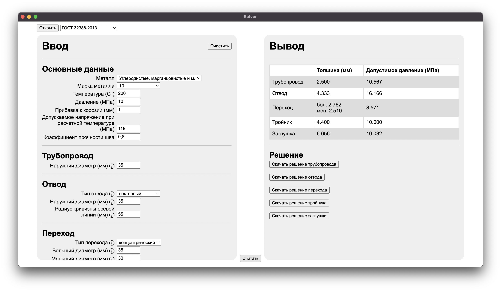
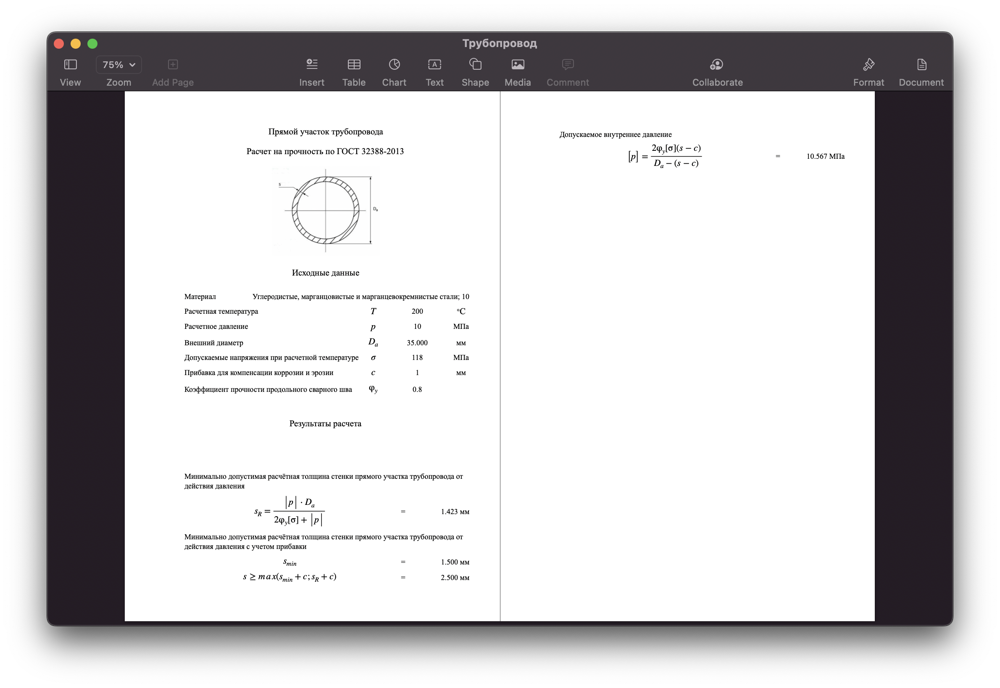

# Pipe Thickness Calculator


Desktop app for calculating pipe wall thickness based on material properties. Exports results to a Word document.

## What's this about

An Electron app that implements pipe thickness calculations according to GOST standards. You fill in the material parameters, the app runs the formulas, and spits out a formatted Word document with the results.





## How to launch

```bash
npm install
npm start
```

To build an installer:

```bash
npm run make
```

## Demo

[nomomon.github.io/pipe-thickness-calculator](https://nomomon.github.io/pipe-thickness-calculator/)
